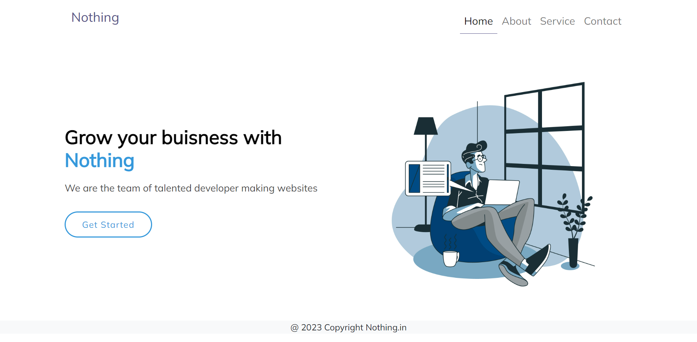
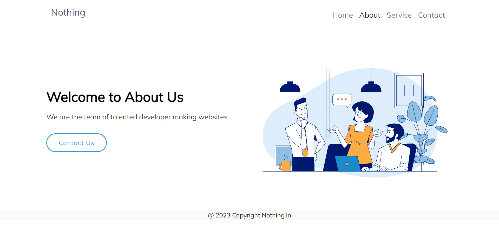
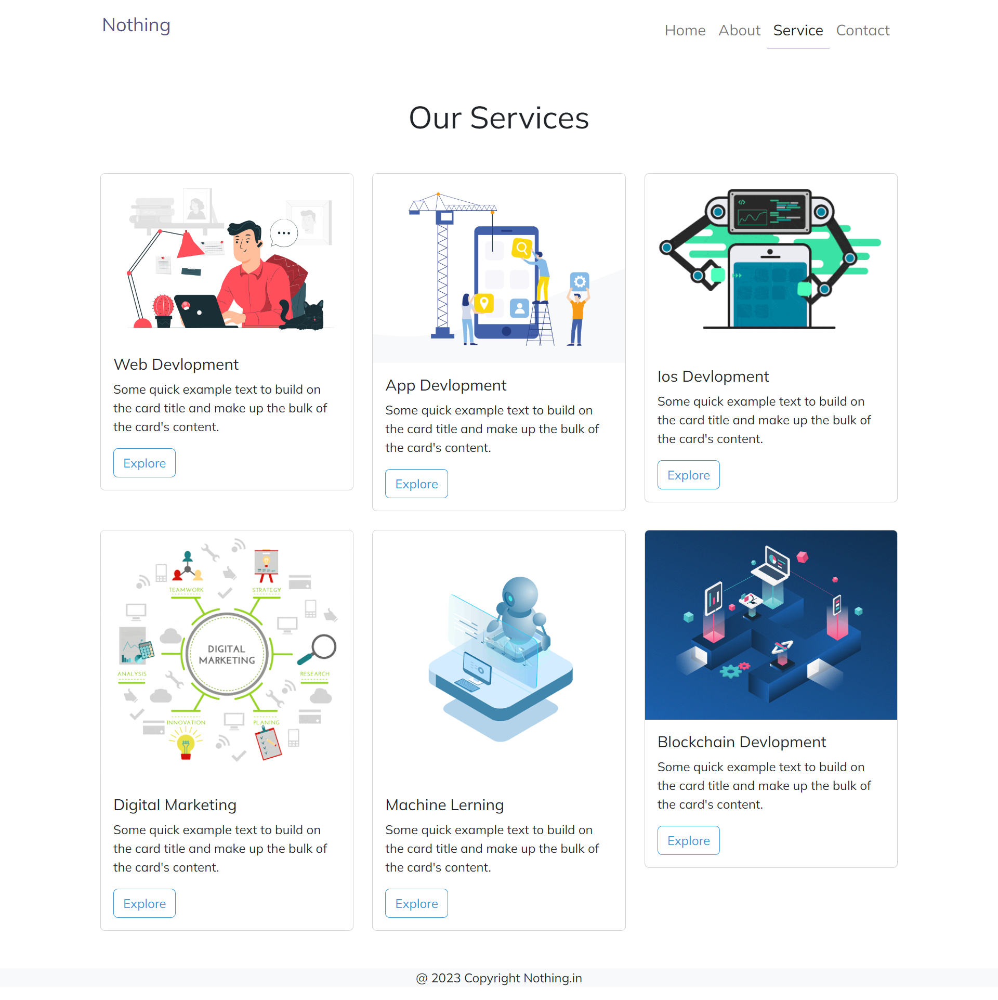
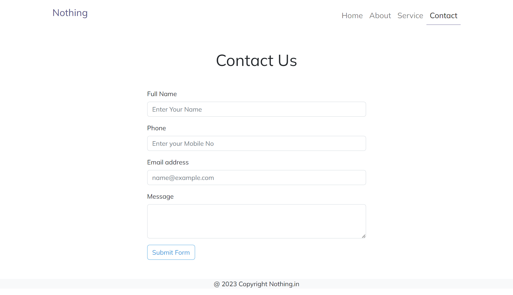

# 👀 Random React Site 👀


## 🚀 Features

- Responsive Design
- React Props


## 🧑‍🚀 Tech Stack

**Client:** React.js, Bootstrap


## 🚀 Run Locally

Clone the project

```bash
  git clone https://github.com/ArnabMukherjee03/My-First-React
```

Go to the project directory

```bash
  cd My-First-React
```

Install dependencies

```bash
  npm install
```

Start the server

```bash
  npm start
```
Server
```bash
  localhost:3000
```

## Screenshots

## Home Page


## About Page


## Service Page


## Contact Page


